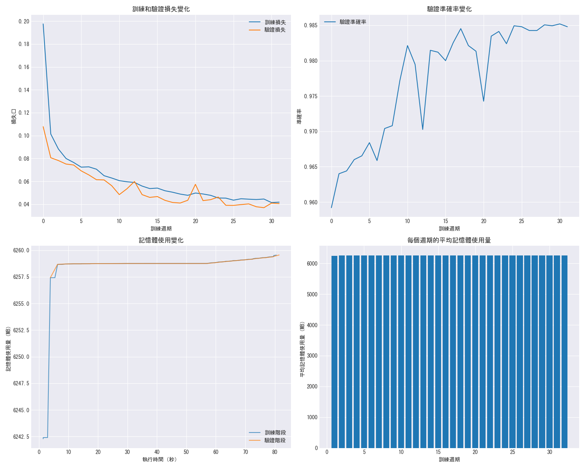

# DDoS 攻擊檢測系統

基於深度學習的網絡流量 DDoS 攻擊檢測系統，支援多種模型架構，能夠有效識別異常網絡流量。

## 專案簡介

本系統使用最新的深度學習技術，實現了高效準確的 DDoS 攻擊檢測。主要特點：

- 支援多種模型架構：Mamba、CNN-LSTM 等
- 自適應記憶體管理策略
- 完整的性能評估與可視化
- 中文化界面與報告
- 靈活的模型訓練與比較功能

## 最新性能比較結果 (2025-04-17)

### 執行效率比較
- **Mamba 模型**:
  - 訓練時間: 63.95 秒
  - 記憶體使用: 增加 2147.08 MB
  
- **CNN-LSTM 模型**:
  - 訓練時間: 82.41 秒
  - 記憶體使用: 增加 2051.77 MB

### 性能指標比較
| 指標 | Mamba | CNN-LSTM |
|------|--------|----------|
| 準確率 | 98.44% | 98.32% |
| 精確率 | 95.43% | 99.06% |
| 召回率 | 96.88% | 92.38% |
| F1 分數 | 96.15% | 95.60% |
| 誤報率 | 1.17% | 0.22% |

## 系統架構

系統由以下主要模組組成：

- `main.py`：主程序入口，處理命令行參數和工作流程
- `models.py`：深度學習模型定義
- `trainer.py`：模型訓練和評估邏輯
- `data_processor.py`：數據預處理和加載
- `test.py`：模型測試功能
- `plots_generator.py`：視覺化圖表生成

## 記憶體管理策略

系統採用自適應記憶體管理策略，主要特點：

1. **初始化清理**：
   - 訓練開始前執行一次完整的記憶體清理
   - 釋放未使用的 Python 對象和 GPU 緩存

2. **自然增長模式**：
   - 允許記憶體使用量自然增長
   - 避免頻繁的記憶體清理，提高訓練效率
   - 實時監控和記錄記憶體使用情況

3. **記憶體監控**：
   - 即時追蹤記憶體使用變化
   - 生成詳細的記憶體使用報告和視覺化圖表

## 安裝與環境配置

### 環境需求

本專案使用 Python 環境進行開發，主要依賴項包括：

- **Python 3.8+**：基礎執行環境
- **PyTorch 1.9+**：深度學習框架，用於模型訓練
- **CUDA**：建議使用 GPU 加速訓練過程
- **psutil**：用於系統資源監控
- **其他依賴**：詳見 `requirements.txt`

### 套件說明

專案的所有依賴項都已在 `requirements.txt` 中列出，主要包括：

1. **基礎科學計算**
   - numpy：用於高效的數組操作
   - pandas：用於數據分析和處理

2. **深度學習相關**
   - torch：PyTorch 深度學習框架
   - mambapy：Mamba 模型實現

3. **機器學習工具**
   - scikit-learn：用於數據預處理和評估

4. **資源監控和視覺化**
   - matplotlib：用於生成圖表
   - psutil：用於系統資源監控

### 安裝步驟

1. 創建並激活虛擬環境（建議）：
```bash
python -m venv venv
.\venv\Scripts\activate  # Windows
source venv/bin/activate  # Unix/MacOS
```

2. 安裝依賴：
```bash
pip install -r requirements.txt
```

3. 檢查 CUDA 可用性（可選）：
```bash
python -c "import torch; print(torch.cuda.is_available())"
```

## 使用方法

### 模型比較模式

執行以下命令比較不同模型的性能：

```bash
python main.py --mode compare --max_samples 50000 --epochs 16
```

參數說明：
- `--max_samples`：使用的數據樣本數量
- `--epochs`：訓練輪次數
- `--device`：使用 'cuda' 或 'cpu'（默認自動選擇）

### 單獨訓練模式

訓練特定模型：

```bash
python main.py --mode train --model_type [mamba/cnnlstm] --epochs 16
```

### 測試模式

評估已訓練模型的性能：

```bash
python main.py --mode test --model_path [model_path]
```

## 輸出圖表說明

系統會自動生成以下視覺化結果：

### 1. 性能比較圖表 (performance_comparison.png)

*此圖展示了不同模型的記憶體使用和執行時間對比。可以看出 Mamba 模型在訓練速度上有明顯優勢。*

### 2. 模型比較圖表 (model_comparison.png)

*此圖比較了不同模型的準確率、精確率、召回率、F1 分數等關鍵指標。CNN-LSTM 在精確率方面表現出色，而 Mamba 在召回率方面更優。*

### 3. 混淆矩陣 (confusion_matrices.png)

*此圖展示了兩個模型的預測結果與實際標籤的對比。可以看出兩個模型都達到了較高的檢測準確度。*

### 4. 訓練歷史 (training_history.png)

*此圖記錄了模型訓練過程中的損失值、準確率變化，以及記憶體使用情況。*

## 性能優化建議

1. **模型選擇**:
   - 對於需要高精確率的場景，建議使用 CNN-LSTM 模型
   - 對於需要快速檢測的場景，建議使用 Mamba 模型

2. **資源使用**:
   - Mamba 模型訓練速度更快，但峰值記憶體使用略高
   - CNN-LSTM 模型記憶體使用更穩定，但訓練時間較長

3. **記憶體管理策略**：
   - 對於大型數據集，採用自然增長模式
   - 確保系統有足夠的記憶體空間
   - 監控記憶體使用趨勢，適時調整批次大小

## 維護與支援

如有問題或建議，請提交 Issue 或聯繫開發團隊。

## 版本記錄

### v1.2.0 (2025-04-17)
- 實現自適應記憶體管理策略
- 優化記憶體監控和可視化
- 更新性能比較報告
- 完善文檔說明

### v1.1.0 (2025-04-17)
- 添加記憶體使用監控
- 改進性能比較可視化
- 優化中文介面
- 完善環境配置文檔

### v1.0.0 (2025-04-16)
- 初始版本發布
- 支援 Mamba 和 CNN-LSTM 模型
- 基礎性能評估功能