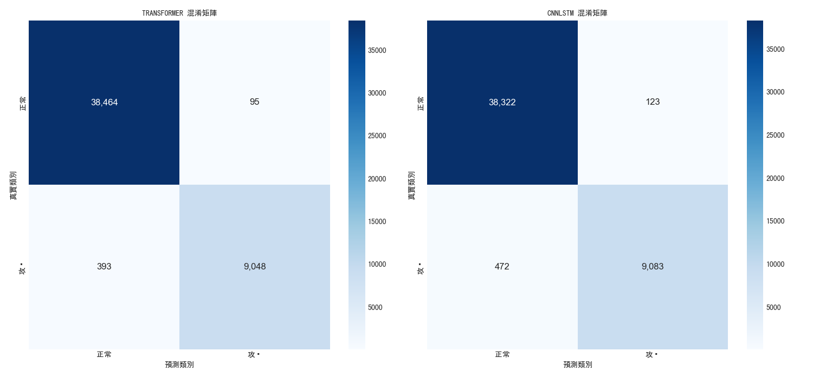

# DDoS 攻擊檢測系統

基於深度學習的網絡流量 DDoS 攻擊檢測系統，支援多種模型架構，能夠有效識別異常網絡流量。

## 專案簡介

本系統使用最新的深度學習技術，實現了高效準確的 DDoS 攻擊檢測。主要特點：

- 支援多種模型架構：Mamba、CNN-LSTM 等
- 即時記憶體使用監控
- 完整的性能評估與可視化
- 中文化界面與報告
- 靈活的模型訓練與比較功能

## 系統架構

系統由以下主要模組組成：

- `main.py`：主程序入口，處理命令行參數和工作流程
- `models.py`：深度學習模型定義
- `trainer.py`：模型訓練和評估邏輯
- `data_processor.py`：數據預處理和加載
- `test.py`：模型測試功能

## 安裝與環境配置

### 環境需求

- Python 3.8+
- PyTorch 1.9+
- CUDA（建議用於 GPU 加速）
- 其他依賴項見 requirements.txt

### 安裝步驟

1. 克隆專案：
```bash
git clone [專案URL]
```

2. 安裝依賴：
```bash
pip install -r requirements.txt
```

## 使用方法

系統提供四種運行模式：訓練、測試、預測和模型比較。

### 訓練模式

訓練新的 DDoS 檢測模型：

```bash
python main.py --mode train --data AllMerged.csv --model_type mamba --epochs 10
```

參數說明：
- `--data`：訓練數據文件路徑
- `--model_type`：模型類型，可選 'mamba' 或 'cnnlstm'
- `--epochs`：訓練輪數
- `--batch_size`：批次大小，默認 128
- `--learning_rate`：學習率，默認 0.001
- `--max_samples`：最大樣本數量，默認 500000

### 測試模式

評估已訓練模型的性能：

```bash
python main.py --mode test --data AllMerged.csv --model_path model.pth
```

參數說明：
- `--data`：測試數據文件路徑
- `--model_path`：模型文件路徑
- `--model_type`：模型類型，需與訓練時一致
- `--max_samples`：最大樣本數量，默認 500000

### 預測模式

使用模型分析新的網絡流量：

```bash
python main.py --mode predict --data new_traffic.csv --model_path model.pth
```

參數說明：
- `--data`：待分析的網絡流量數據文件
- `--model_path`：模型文件路徑
- `--model_type`：模型類型，需與訓練時一致

### 模型比較模式

比較不同模型架構的性能：

```bash
python main.py --mode compare --data AllMerged.csv
```

系統會自動訓練並比較不同模型架構，生成比較報告和可視化圖表。

## 輸出與可視化

系統會生成以下視覺化結果：

- `training_history.png`：訓練過程中的損失、準確率和記憶體使用情況。
  
  *此圖展示了模型在訓練過程中的損失值和準確率變化，幫助用戶了解模型的收斂情況。*

- `model_comparison.png`：不同模型的性能對比。
  
  *此圖比較了不同模型的準確率、精確率、召回率和 F1 分數，幫助用戶選擇最佳模型。*

- `confusion_matrices.png`：混淆矩陣視覺化。
  
  *此圖展示了模型的預測結果與實際標籤的對比，幫助用戶分析模型的分類性能。*

## 性能指標

系統評估以下關鍵指標：

- 準確率 (Accuracy)
- 精確率 (Precision)
- 召回率 (Recall)
- F1 分數
- 誤報率 (FPR)

## 後續開發方向

- 支援更多深度學習模型架構
- 增加分散式訓練支援
- 優化記憶體使用效率
- 加入更多數據預處理選項

## 維護與支援

如有問題或建議，請聯繫：[您的聯繫方式]

## 版本記錄

- v1.0.0 (2025-04-17)
  - 支援 Mamba 和 CNN-LSTM 模型
  - 添加記憶體使用監控
  - 更新中文化界面