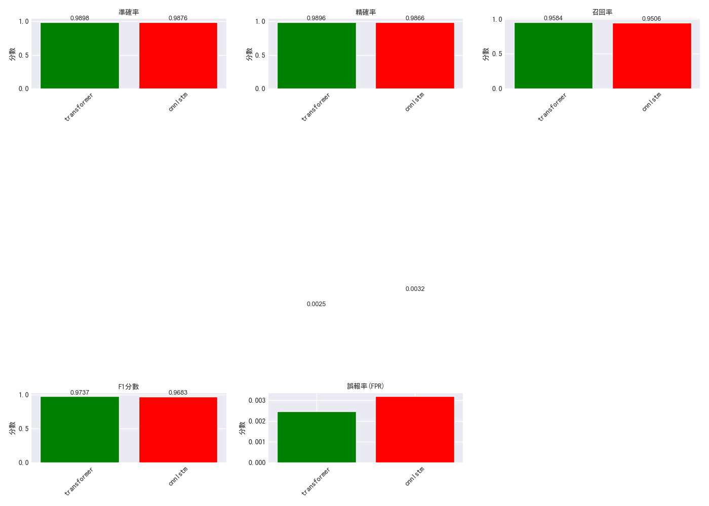
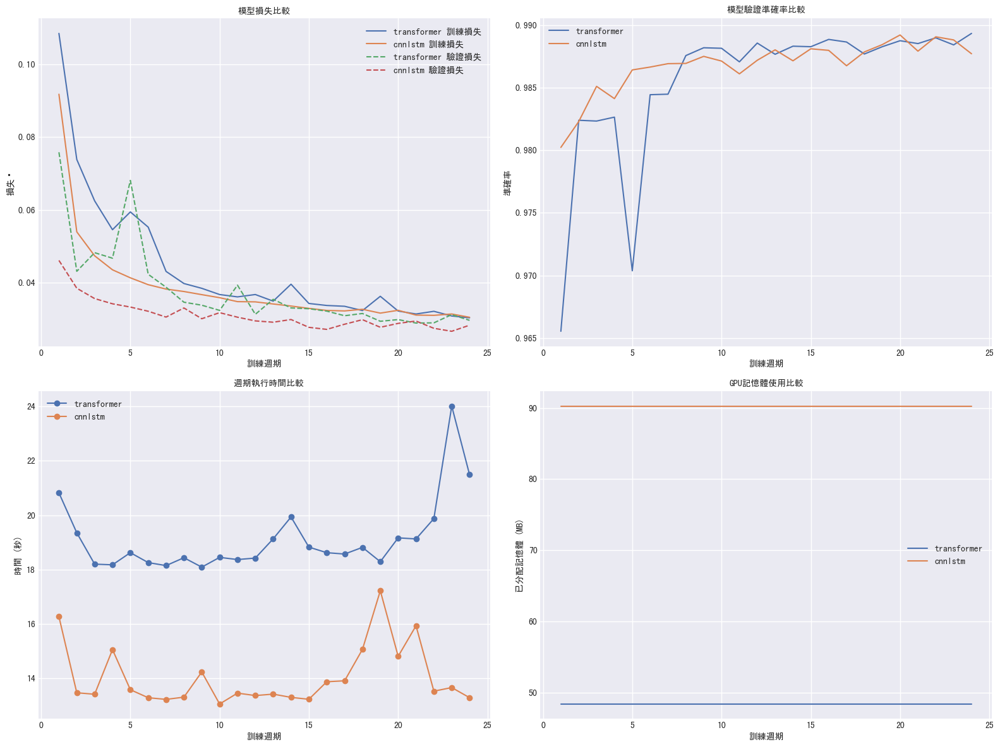
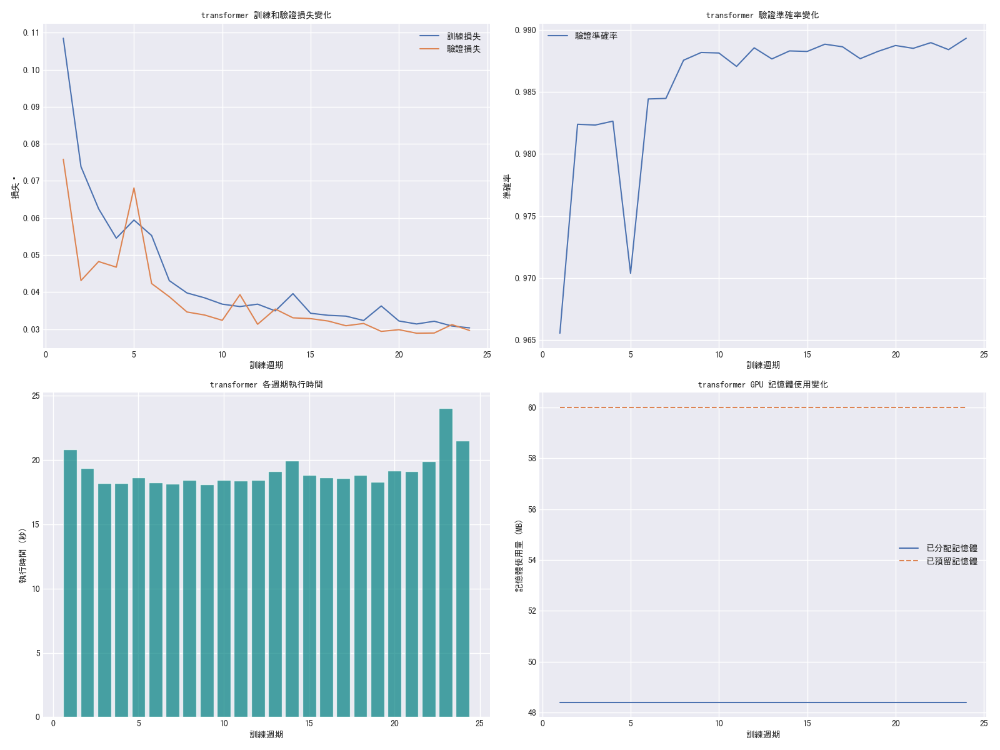

# DDoS 攻擊檢測系統

基於深度學習的網絡流量 DDoS 攻擊檢測系統，支援多種模型架構，能夠有效識別異常網絡流量。

## 專案簡介

本系統使用最新的深度學習技術，實現了高效準確的 DDoS 攻擊檢測。主要特點：

- 支援多種模型架構：Transformer、CNN-LSTM 等
- 自適應記憶體管理策略
- 完整的性能評估與可視化
- 中文化界面與報告
- 靈活的模型訓練與比較功能
- CSV 數據記錄和基於 CSV 的圖表生成

## 最新性能比較結果 (2025-04-22)

### 執行效率比較
- **Transformer 模型**:
  - 訓練時間: 85.62 秒
  - 記憶體使用: 增加 2151.84 MB
  
- **CNN-LSTM 模型**:
  - 訓練時間: 87.25 秒
  - 記憶體使用: 增加 2039.95 MB

### 性能指標比較
| 指標 | Transformer | CNN-LSTM |
|------|--------|----------|
| 準確率 | 98.75% | 98.41% |
| 精確率 | 99.38% | 98.23% |
| 召回率 | 94.39% | 93.67% |
| F1 分數 | 96.82% | 95.90% |
| 誤報率 | 0.15% | 0.42% |

## 系統架構

### 系統流程圖


系統主要由以下模組組成：

- `main.py`：主程序入口，處理命令行參數和工作流程
- `models.py`：深度學習模型定義
- `trainer.py`：模型訓練和評估邏輯
- `data_processor.py`：數據預處理和加載
- `test.py`：模型測試功能
- `plots_generator.py`：視覺化圖表生成

### 數據記錄與圖表生成

系統現已加入完整的數據記錄與圖表生成功能：

1. **數據記錄**
   - 訓練過程數據記錄到 CSV 文件 (`logs/{model_type}_training_log.csv`)
   - 評估結果數據記錄到 CSV 文件 (`logs/{model_type}_evaluation_result.csv`)
   - 批次評估數據記錄到 CSV 文件 (`logs/{model_type}_batch_evaluation.csv`)

2. **圖表生成**
   - 從 CSV 文件生成訓練歷史圖表
   - 從 CSV 文件生成評估結果圖表
   - 從 CSV 文件生成多模型比較圖表

這種設計使得數據記錄與圖表生成解耦，便於後續分析和比較，無需重新訓練模型。

### 詳細模型架構

系統現在支援查看詳細的模型架構摘要，包括：

- 每一層的結構和參數
- 輸入/輸出張量的形狀
- 參數數量統計
- 計算量（FLOPs）估計

這些資訊在模型創建時會自動顯示，有助於：
- 理解模型結構
- 診斷潛在問題
- 優化模型設計
- 比較不同模型架構

### 詳細流程說明

1. **數據輸入與預處理階段**
   - 讀取原始網路流量數據
   - 進行特徵提取和標準化
   - 數據切割為訓練集和測試集

2. **模型訓練階段**
   - 選擇模型架構（Transformer 或 CNN-LSTM）
   - 設定訓練參數
   - 執行模型訓練
   - 記憶體使用監控和優化
   - 訓練數據記錄到 CSV

3. **評估與輸出階段**
   - 模型性能評估
   - 評估數據記錄到 CSV
   - 從 CSV 生成視覺化報告
   - 輸出詳細分析結果

## 記憶體管理策略

系統採用自適應記憶體管理策略，主要特點：

1. **初始化清理**：
   - 訓練開始前執行一次完整的記憶體清理
   - 釋放未使用的 Python 對象和 GPU 緩存

2. **數據順序處理**：
   - 採用順序切割代替隨機採樣
   - 確保數據處理的一致性和可重現性
   - 減少記憶體碎片化

3. **記憶體監控**：
   - 即時追蹤記憶體使用變化
   - 生成詳細的記憶體使用報告和視覺化圖表
   - 自動調整批次大小以優化記憶體使用

## 安裝與環境配置

### 環境需求

本專案使用 Python 環境進行開發，主要依賴項包括：

- **Python 3.8+**：基礎執行環境
- **PyTorch 1.9+**：深度學習框架，用於模型訓練
- **CUDA**：建議使用 GPU 加速訓練過程
- **psutil**：用於系統資源監控
- **其他依賴**：詳見 `requirements.txt`

### 套件說明

專案的所有依賴項都已在 `requirements.txt` 中列出，主要包括：

1. **基礎科學計算**
   - numpy：用於高效的數組操作
   - pandas：用於數據分析和處理

2. **深度學習相關**
   - torch：PyTorch 深度學習框架

3. **機器學習工具**
   - scikit-learn：用於數據預處理和評估

4. **資源監控和視覺化**
   - matplotlib：用於生成圖表
   - seaborn：用於高級統計圖形
   - psutil：用於系統資源監控

### 安裝步驟

1. 創建並激活虛擬環境（建議）：
```bash
python -m venv venv
.\venv\Scripts\activate  # Windows
source venv/bin/activate  # Unix/MacOS
```

2. 安裝依賴：
```bash
pip install -r requirements.txt
```

3. 檢查 CUDA 可用性（可選）：
```bash
python -c "import torch; print(torch.cuda.is_available())"
```

## 使用方法

### 模型比較模式

執行以下命令比較不同模型的性能：

```bash
python main.py --mode compare --max_samples 200000 --epochs 10
```

參數說明：
- `--max_samples`：使用的數據樣本數量
- `--epochs`：訓練輪次數
- `--device`：使用 'cuda' 或 'cpu'（默認自動選擇）

### 單獨訓練模式

訓練特定模型：

```bash
python main.py --mode train --model_type [transformer/cnnlstm] --epochs 10
```

### 測試模式

評估已訓練模型的性能：

```bash
python main.py --mode test --model_path [model_path]
```

## 輸出文件

系統會自動生成以下輸出文件：

### 1. CSV 數據記錄文件

- **訓練記錄**：`logs/{model_type}_training_log.csv`
  - 包含每個訓練週期的損失、準確率、執行時間等

- **評估結果**：`logs/{model_type}_evaluation_result.csv`
  - 包含模型評估的性能指標、混淆矩陣數據等

- **批次評估**：`logs/{model_type}_batch_evaluation.csv`
  - 包含每個批次的損失和準確率

### 2. 圖表文件

- **訓練歷史圖表**：`plots/{model_type}_training_history.png`
  - 展示訓練過程中的損失、準確率等指標變化

- **混淆矩陣**：`plots/{model_type}_confusion_matrix.png`
  - 展示模型分類結果的詳細分析

- **性能指標圖表**：`plots/{model_type}_performance_metrics.png`
  - 展示模型的準確率、精確率、召回率等指標

- **批次評估圖表**：`plots/{model_type}_batch_evaluation.png`
  - 展示每個批次的損失和準確率變化

- **比較圖表**：
  - `plots/performance_comparison.png`
  - `plots/resource_comparison.png`
  - `plots/training_process_comparison.png`
  - `plots/confusion_matrices.png`

## 視覺化結果展示

系統會自動生成以下視覺化結果：

### 1. 性能比較圖表 


此圖展示了不同模型在準確率、精確率、召回率、F1 分數和誤報率等指標上的表現對比。

### 2. 資源使用比較圖表 


展示了不同模型的訓練時間和記憶體使用情況對比。

### 3. 訓練過程比較圖表 


展示了不同模型在訓練過程中損失值、準確率、執行時間和記憶體使用的變化趨勢對比。

### 4. 混淆矩陣比較 


提供了詳細的分類結果分析：
- 真陽性/假陽性比例
- 真陰性/假陰性比例
- 分類準確度視覺化

### 5. 個別模型訓練歷史 


記錄了單一模型訓練過程中的重要指標：
- 損失值變化趨勢
- 準確率提升曲線
- 記憶體使用追蹤
- 執行時間分析

## 性能優化建議

1. **模型選擇**:
   - 追求高精確率：選用 Transformer 模型（99.38% 精確率）
   - 追求低誤報率：選用 Transformer 模型（0.15% 誤報率）
   - 追求執行效率：兩種模型執行時間相近（85-87秒）

2. **資源使用考量**:
   - Transformer 模型：較高的峰值記憶體（2151.84 MB），執行時間略優
   - CNN-LSTM 模型：較低的記憶體使用（2039.95 MB），執行時間略長

3. **記憶體管理建議**：
   - 使用順序數據切割以提高效率
   - 監控記憶體使用趨勢
   - 根據系統資源調整批次大小

## 維護與支援

如有問題或建議，請提交 Issue 或聯繫開發團隊。

## 版本記錄

### v1.3.0 (2025-04-22)
- 加入 CSV 數據記錄功能
- 實現從 CSV 文件生成圖表
- 優化中文字體顯示
- 更新 README 文檔

### v1.2.2 (2025-04-17)
- 加入模型架構摘要顯示功能
- 整合 torchinfo 提供詳細模型資訊
- 優化模型參數統計
- 更新文檔說明

### v1.2.1 (2025-04-17)
- 更新為順序數據切割策略
- 優化性能指標計算
- 更新性能比較數據
- 完善文檔說明

### v1.2.0 (2025-04-17)
- 實現自適應記憶體管理策略
- 優化記憶體監控和可視化
- 更新性能比較報告
- 完善文檔說明

### v1.1.0 (2025-04-17)
- 添加記憶體使用監控
- 改進性能比較可視化
- 優化中文介面
- 完善環境配置文檔

### v1.0.0 (2025-04-16)
- 初始版本發布
- 支援 Transformer 和 CNN-LSTM 模型
- 基礎性能評估功能